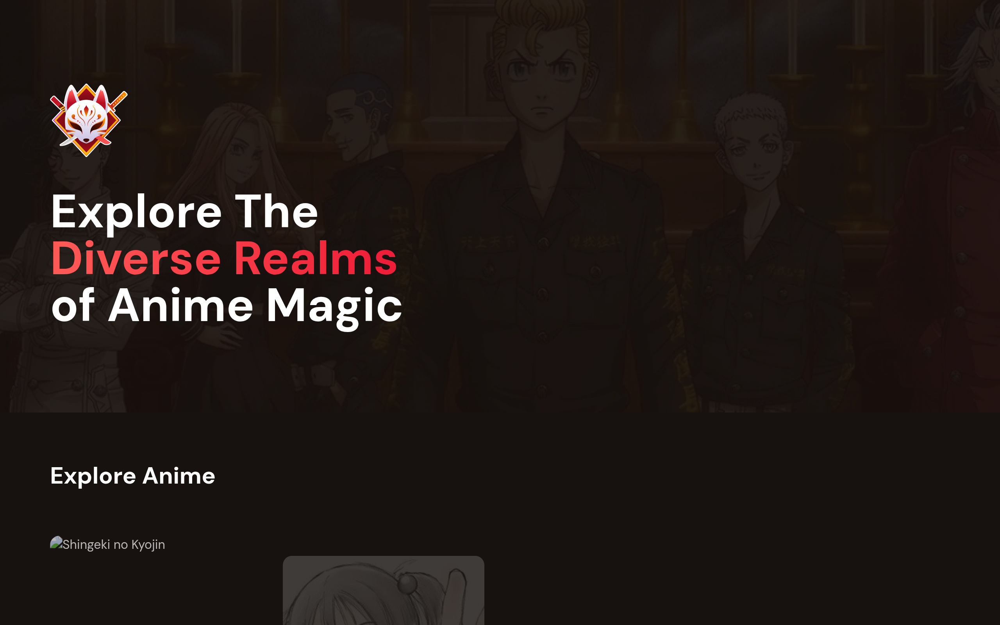
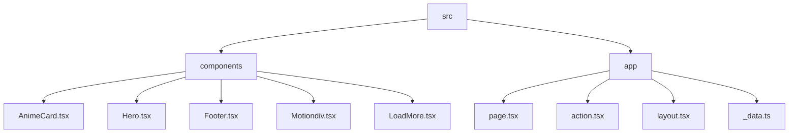

# Animex: A Next.js Anime Showcase

## 🗂️ Description

Animex is a Next.js-based web application designed to showcase a curated list of anime cards, complete with images, descriptions, and details. This project aims to provide a visually appealing and user-friendly interface for anime enthusiasts to discover and explore their favorite shows. Built with modern web technologies, Animex offers a seamless and performant browsing experience.

## ✨ Key Features

### Core Features

* **Anime Card Grid**: A responsive grid displaying a list of anime cards, each featuring an image, title, and details.
* **Load More Button**: A load more button that fetches additional anime data, allowing users to explore more shows.
* **Hero Section**: A prominent hero section showcasing a featured anime image, text, and logo.

### Technical Features

* **Server-side Rendering**: Next.js-powered server-side rendering for improved SEO and performance.
* **TypeScript**: TypeScript-based development for enhanced code maintainability and scalability.
* **Tailwind CSS**: Tailwind CSS for streamlined styling and a consistent design language.

## 🗂️ Folder Structure

## 🛠️ Tech Stack

## ⚙️ Setup Instructions

To run the project locally, follow these steps:

* Git clone the repository: `https://github.com/Xeven777/Animex.git`
* Install dependencies: `npm install` or `yarn install`
* Start the development server: `npm run dev` or `yarn dev`

## 📁 Configuration Files

The project uses the following configuration files:

* `.eslintrc.json`: ESLint configuration file that extends the Next.js core web vitals configuration.
* `postcss.config.js`: PostCSS configuration file that uses Tailwind CSS and Autoprefixer plugins.
* `next.config.js`: Next.js configuration file that specifies settings for image optimization and remote patterns.
* `tailwind.config.ts`: Tailwind CSS configuration file that specifies settings for content, theme, and plugins.
* `tsconfig.json`: TypeScript configuration file that specifies compiler options, include and exclude files, and paths for the project.

## 🤖 GitHub Actions

This repository uses GitHub Actions for automated workflows. The current workflow includes:

* **Lint and Build**: A workflow that runs ESLint and builds the project on push events.

No additional workflow configurations are currently set up.

  

<h3>Anish</h3>

Passionate developer with a love for problem-solving, efficient and creative thinking.

 

  <a href="https://gitfull.vercel.app">Made by GitFull</a>

    